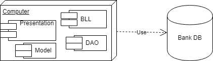

# Analysis and Design Document

# Requirement analysis

## Assignment Specification
The assignment is to design and implement an application for the front desk employees of a bank. The application should have two types of users (a regular user represented by the front desk employee and an administrator user) which have to provide a username and a password in order to use the application.  Both type of user can perform a set of operations, which are presented in the use-case diagrams and some of these actions are further presented in use case scenarios.  The application is written in JAVA programming language.

## Functional requirements
The Functional Requirements document the operations and activities that a system must be able to perform. 

- **Interface requirements:** 

  *1. The fields must be completed when wishing to perform operations like adding or updating something in the database.*

  *2. The interfaces will display message dialogs after performing the operations of adding, updating or deleting something from the database, as well as making transfers between accounts.*

  *3. The name, social security number, address and other fields that should be strings, and cannot accept numeric data entry.*

- **Business Requirements:**

  *1. Data must be entered before a request can be approved.*

  *2. All the front desk employees using the application must have a little understanding on how the operations are performed and which data is mandatory for each operation.*

- **Regulatory/Compliance Requirements:**

  *1. The application will limit access to authorized, existing users.*

## Non-functional Requirements
 The non-functional requirements or quality attributes are  requirements that specifies criteria that can be used to judge the operation of a system, rather than specific behaviors.

- **Security:**  To cover the aspect of confidentiality it is very important to achieve authentication, so the users are required to log into the bank system by providing a username and a password, it also helps in preventing unauthorized users to log in. 
- **Usability:** The desktop user-interface shall be Windows 7/8/10 compliant, and the interface should be designed for ease-of-use and should be easy to understand by the users, with just a little training on the System.
- **Performance:** The database access response time should be quick enough and the transactions must be completed without problems and also fast.
- **Testability:**  If the testability of the software artifact is high, then finding faults in the system if such faults exist, by means of testing is easier. The application should be tested to see if at least some of the operation have completed successfully.

# Use-Case Model
The main actors are the regular user, also known as the front desk employee, and the administrator. Below are the use-case diagrams, that showcase all the actions that they can make in the Bank system.

The **Front Desk Employee** use-case diagram:

The **administrator'** use-case diagram:

## Use case 1

    * Use case: Add client information
    * Level: User-goal level
    * Primary actor: Front Desk Employee (regular user)
    * Main success scenario: The front desk employee provides an email adress and a password to log into the system, selects that he is a regular user not the administrator, and presses the log in button which opens the system' interface for him. He must complete the fields of id, client name, client ssn, client identity card number, client address and mention if the client is an utility provider by saying YES or NO in the field utility provider. After completing all these fields, the user must press the button ADD CLIENT, the system takes all the information provided in the text fields, and makes the entry in the database, after that displaying the message that the client has been added.
    * Extensions: Scenario of failure
    - the user does not provide correct login information so he can't get access to the operations.
    - the user enters client data that does not pass the validation tests against the database, so a message dialog is displayed to announce what data is not valid.

## Use case 2

    * Use case: Process utilities bills
    * Level: User-goal level
    * Primary actor: Front Desk Employee (regular user)
    * Main success scenario: The front desk employee provides an email adress and a password to log into the system, selects that he is a regular user not the administrator, and presses the log in button which opens the system' interface for him. He presses the button process utilities bills and another window opens where he must enter the account number of the one that wishes to make the payment, the sum of the utility bill and select from the list that appears the utility provider to which the payment should be made. After selecting and completing the required things, the user presses the button MAKE PAYMENT. The system takes the account number, searches for the account number of the utility provider and then makes a transfer between the two acoounts, completing the payment.
    * Extensions: Scenario of failure
    - the user does not provide correct login information so he can't get access to the operations.
    - the user enters an inexistent account number from which the payment should be made, so the processing of the utility bill is not completed.

## Use case 3

    * Use case: Generate reports for a particular period containing the activities performed by an employee.
    * Level: user-goal level
    * Primary actor: Administrator
    * Main success scenario: The system successfully records in a text file each action performed by the regular user: the login, every operation made, by traking the buttons that were pressed. The administrator provides an email adress and a password to log into the system, selects that he is an administrator, and presses the log in button which opens the system' interface for him. He must provide the social security number (ssn) for the employee he wants to generate a report and the period he wants in the format of "yyyy/mm/dd" and then press the button GENERATE REPORT. The system takes the input and searches in the EmployeeActivity file for the given employee, and after that makes a new report file containing only the activities in the specified period.
    * Extensions: Scenario of failue
    - the administrator does not provide correct login information so he can't get access to the operations.
    - the administrator does not enter the employee ssn before wanting to generate the report for a certain period, which leads to an error because the system tries to find someone with a null ssn

# System Architectural Design

## Architectural Pattern Description

In designing the application the Layers architectural pattern was used.

For the **Layers architectural pattern**, each layer of the layered architecture pattern has a specific role and responsibility within the application. For example, the presentation layer would be responsible for handling all user interface and browser communication logic, whereas the business layer would be responsible for executing specific business rules associated with the request. Each layer in the architecture forms an abstraction around the work that needs to be done to satisfy a particular business request. 

## Diagrams
Create the system’s conceptual architecture; use architectural patterns and describe how they are applied. Create package, component and deployment diagrams

- **PACKAGE DIAGRAM**

- **COMPONENT DIAGRAM**

  

  

- **DEPLOYMENT DIAGRAM**

  

# UML Sequence Diagrams

A *sequence diagram* shows object interactions arranged in time *sequence*. It depicts the objects and classes involved in the scenario and the *sequence* of messages exchanged between the objects needed to carry out the functionality of the scenario.

Sequence diagram for the transfer between account operation/scenario, after the user has logged in.

# Class Design

## Design Patterns Description
The design patterns used for the application are a domain logic pattern (transaction script) and a data source pure pattern (table data gateway). 

**Transaction script** design pattern organizes business logic by procedures where each procedure handles a single request from the presentation. A Transaction Script organizes all this logic primarily as a single procedure, making calls directly to the database or through a thin database wrapper. 

**Table data gateway** implies an object that acts as a Gateway to a database table. One instance handles all the rows in the table. Mixing SQL in application logic can cause several problems. A Table Data Gateway holds all the SQL for accessing a single table or view: selects, inserts, updates, and deletes. Other code calls its methods for all interaction with the database.

## UML Class Diagram

# Data Model
In the development and implementation of the application I have used the ***relational data model*** which is a database model based on first-order predicate logic and its idea is to describe a database as a collection of predicates over a finite set of predicate variables, describing constraints on the possible values and combinations of values. The data is stored in four tables in an MySQL relational database. The operations made by the users also affect the database, modifications occurring each time an operation is performed.

Also, ***Unified Modeling Language*** model was used for visualizing, specifying, constructing, and documenting the artifacts of the bank system application. The Unified Modeling Language offered a standard way to write the system's blueprints.

# System Testing
A software test is a piece of software, which executes another piece of software. It validates if that code results in the expected state (state testing) or executes the expected sequence of events (behavior testing). To verify that the logic of certain pieces of the program are correct unit tests should be written. A *unit test* is a piece of code written that executes a specific functionality in the code to be tested and asserts a certain behavior or state.

The tests for this application will be made using JUnit framework. The testing will target a small unit of code, like some methods to see if the access and operations to the database were done successfully, or a class, to see if certain methods there work properly. 

# Bibliography
- [Online diagram drawing software](https://yuml.me/) ([Samples](https://yuml.me/diagram/scruffy/class/samples))
- [Yet another online diagram drawing software](https://www.draw.io)
- https://martinfowler.com/eaaCatalog/tableDataGateway.html
- https://martinfowler.com/eaaCatalog/transactionScript.html
