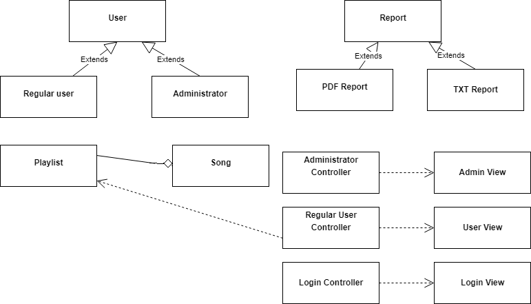
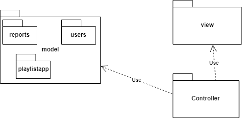
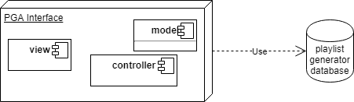
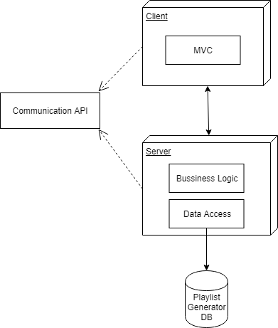
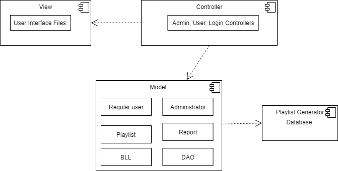

# Playlist Generator Specification
The Playlist Generator Application is an desktop application for generating playlists and has many other features so the users can make their own playlists, add/remove friends, rate songs. The objective of the PGA is to make a nice environment for users to search new songs, create their playlists and share their favorite songs with friends.

There are two types of users, the regular users and the administrator. Some of the non-functional requirements that most concern the users are security, availability and performance. Regarding security, the users will have to log into the application using an username/email and a password, which will have to be valid and already registered in the database. This prevents unauthorized users to log in. The application will be available as a desktop application and anyone who has a personal computer can use it and concerning performance, the access and operations desired by the users will be performed as quick as possible.

# Elaboration – Iteration 1.1

## Domain Model
The persistence will be implemented in the package playlistapp from the Model (MVC), the domain model incorporates both behavior and data. Due to the fact that the business logic can be very complex, the domain model creates a web of interconnected objects, where each object represents some meaningful individual. The data will be stored in a relational database in MySQL and there will be tables for the users, playlists and songs.

The conceptual class diagram is showcased below:

## Architectural Design

### Conceptual Architecture
In implementing the application I will use MVC (Model-View-Controller) pattern because in this way I wish to separate the application's concerns. Model will be carrying data and it can also have logic to update controller if its data changes. View represents the visualization of the data that model contains, and it will be designed for ease-of-use. Controller acts on both model and view. It controls the data flow into model object and updates the view whenever data changes, and it keeps view and model separate. 

For generating the reports that can be either in pdf or txt format, the Factory Method pattern will be used because it's a creational pattern that enables us to create an object without exposing the creation logic to the client and it is realized by defining an interface for creating an object, but let subclasses decide which class to instantiate. 

At a later stage, the application will be transformed into a client-server one. This client-server pattern consists of two parties: a server and multiple clients. The server component will provide services to multiple client components. Clients request services from the server and the server provides relevant services to those clients. The layer that did the persistence should be moved to the server, and the client can only retrieve that data by communicating with the server. Most of the business logic will also be on the server side. 

In order to take care of the live notifications that the users receive when another user recommends them a song, I will use the Observer Pattern because it specifies communication between objects: *observable* and *observers*. An observable is an object which notifies observers about the changes in its state.

For the final part, the overall application will be refined and the final features will be added. These new features will allow the regular users to rate the songs once with a grade from 1-5 stars and also search by rating, remove friends from their list of friends, and request the system to have a playlist generated for them. For the administrator, only the feature of editing the songs ratings will be added.

### Package Design

### Component and Deployment Diagrams

- Deployment diagram MVC

- Deployment diagram Client-Server

  

- Component diagram

  

# Elaboration – Iteration 1.2

## Design Model

### Dynamic Behavior
[Create the interaction diagrams (1 sequence, 1 communication diagrams) for 2 relevant scenarios]

### Class Design
[Create the UML class diagram; apply GoF patterns and motivate your choice]

### Data Model
[Create the data model for the system.]

### Unit Testing
[Present the used testing methods and the associated test case scenarios.]

# Elaboration – Iteration 2

## Architectural Design Refinement
[Refine the architectural design: conceptual architecture, package design (consider package design principles), component and deployment diagrams. Motivate the changes that have been made.]

## Design Model Refinement
[Refine the UML class diagram by applying class design principles and GRASP; motivate your choices. Deliver the updated class diagrams.]

# Construction and Transition

## System Testing
[Describe how you applied integration testing and present the associated test case scenarios.]

## Future improvements
[Present future improvements for the system]

# Bibliography
- [Architectural Styles](https://docs.microsoft.com/en-us/azure/architecture/guide/architecture-styles/)
- [Architectural Patterns and Styles](https://msdn.microsoft.com/en-us/library/ee658117.aspx)
- [Online diagram drawing software](https://yuml.me/) ([Samples](https://yuml.me/diagram/scruffy/class/samples))
- [Yet another online diagram drawing software](https://www.draw.io)
- <https://www.baeldung.com/java-observer-pattern>
