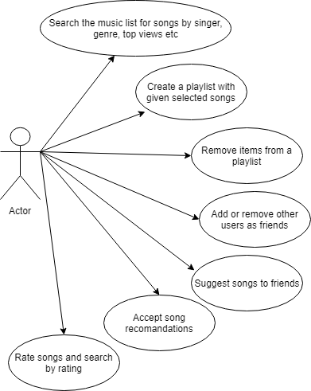
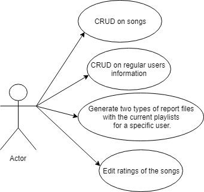

# Playlist Generator Use Case Model

# Use-Cases Identification
The main actors are the regular users and the administrator. 

Below are the use cases for the regular users and the administrator:

- Regular users

  

- Administrator

  

Some of the most general use cases for both users are presented and described in natural language in the document.

## Use case 1

* **Use case**: Create a playlist with given selected songs.
* **Level**: User-goal level.
* **Primary actor**: Regular user.
* **Main success scenario**: The user logs in successfully into the PGA with a valid username and password, selects various songs and selects the "Create playlist" option, enters the playlist name, and the playlist is created.
* **Extensions**: Scenarios of failure:
  1. The user does not provide a correct username or password and can't log into the PGA.
  2. If no song is selected and the user selects "Create playlist" option, the playlist can't be created and a message dialog is displayed.

## Use case 2
* **Use case**: Search the music list for songs by singer, genre, top views.
* **Level**: User-goal level.
* **Primary actor**: Regular user.
* **Main success scenario**: The user logs in successfully into the PGA with a valid username and password, enters what he wants to search in the space near the button corresponding to the search he wishes to make: "Search by singer", "Search by genre" or "Search by top views", presses the button and the search is performed. A list of songs that match the criteria is displayed.
* **Extensions**: Scenarios of failure:
  1. The user does not provide a correct username or password and can't log into the PGA.
  2. If the search information is not providing before clicking the buttons, the search is not performed and a message dialog is displayed.

## Use case 3
* **Use case**: CRUD on songs (song information: title, genre, singer, view count).
* **Level**: User-goal level.
* **Primary actor**: Administrator
* **Main success scenario**: The administrator logs in successfully into the PGA with a valid username and password, ands selects the fact that he is an administrator, the admin interface appears, and he can select the operation to be performed: create/add, read, delete, update; Example: he inputs the data in the fields necessary for the addition of a new song and presses the "Add song" button, resulting in the addition of the song in the table Songs from the Playlist Generator Database. For deleting a song, he inputs the name of the song and the artist and presses the button "Delete song" and the song is deleted from the database.
* **Extensions**: Scenarios of failure:
  1. The administrator does not provide a correct username or password and can't log into the PGA.
  2. Not all the fields needed are completed, the operation is not performed. 
  3. If the administrator wants to update/edit a song that does not exist in the database an error message is displayed.
  4. If the song already exists in the database, the administrator can't add it again.

## Use case 4
* **Use case**: Generate report files.
* **Level**: User-goal level.
* **Primary actor**: Administrator
* **Main success scenario**: The administrator logs in successfully into the PGA with a valid username and password, ands selects the fact that he is an administrator, the admin interface appears, selects that he wants to generate a report file with the current playlists for a specific user, after he specifies the username of the regular user. The reports are saved in a user-selected location (not predefined by the application), similar on how one would save a file from Notepad.
* **Extensions**: Scenarios of failure:
  1. The administrator does not provide a correct username or password and can't log into the PGA.
  2. The administrator does not provide the input for the user name and presses the button to generate a report file, the report file is not generated and a message dialog is displayed. 
  3. The creation of the report fails if the user-selected location is not specified, the location must be specified and then try again to generate the report file.

# UML Use-Case Diagrams

## Diagram 1

## Diagram 2

## Diagram 3

## Diagram 4

# Bibliography

* [Online diagram drawing software](https://yuml.me/) ([Samples](https://yuml.me/diagram/nofunky/usecase/samples))
* [Yet another online diagram drawing software](https://www.draw.io)
* [Use case templates and examples](http://templatelab.com/use-case-templates/)
